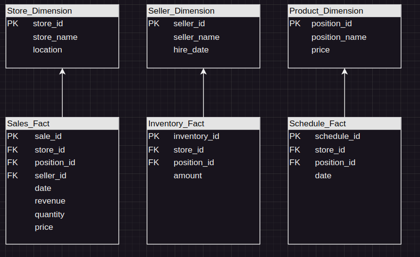

to start airflow:
astro dev start

What bot needs is:
- trigger data loader
- trigger salary 
- get data to show

How to solve:
- create dag to compute salary
- create dag for backup the drive

PostgreSQL schema:

timeline:
13.01 + create postgres scheme 
14.01 + setup postgres
14.01 + setup clickhouse
17.01 + setup the connectors
20.01 + create etl from drive to postgres
20.01 + create etl from drive to postgres - extract
20.01 + create etl from drive to postgres - transform
20.01 + create etl from drive to postgres - load